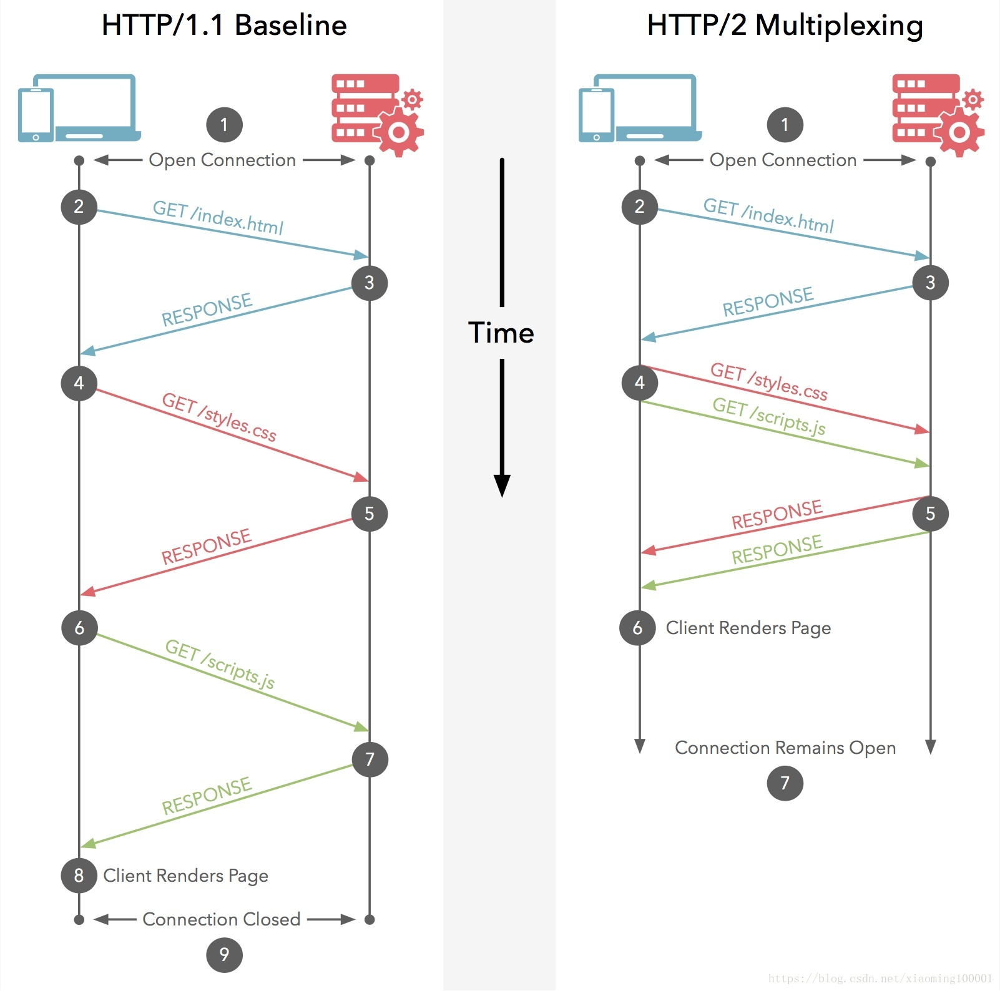

### Http1.1和Http2.0的区别

- ### 多路复用

​    HTTP2.0使用了多路复用的技术，做到同一个连接并发处理多个请求，而且并发请求的数量比HTTP1.1大了好几个数量级。HTTP1.1也可以多建立几个TCP连接，来支持处理更多并发的请求，但是创建TCP连接本身也是有开销的。

多路复用：通过单一的HTTP/2连接请求发起多重的请求-响应消息，多个请求stream共享一个TCP连接，实现多路并行而不是依赖建立多个TCP连接。

- ### 头部数据压缩

​    在HTTP1.1中，HTTP请求和响应都是由状态行、请求/响应头部、消息主体三部分组成。一般而言，消息主体都会经过gzip压缩，或者本身传输的就是压缩过后的二进制文件，但状态行和头部却没有经过任何压缩，直接以纯文本传输。随着Web功能越来越复杂，每个页面产生的请求数也越来越多，导致消耗在头部的流量越来越多，尤其是每次都要传输UserAgent、Cookie这类不会频繁变动的内容，完全是一种浪费。

​    HTTP1.1不支持header数据的压缩，HTTP2.0使用HPACK算法对header的数据进行压缩，这样数据体积小了，在网络上传输就会更快。

- ### 服务器推送

​    服务端推送是一种在客户端请求之前发送数据的机制。网页使用了许多资源：HTML、样式表、脚本、图片等等。在HTTP1.1中这些资源每一个都必须明确地请求。这是一个很慢的过程。浏览器从获取HTML开始，然后在它解析和评估页面的时候，增量地获取更多的资源。因为服务器必须等待浏览器做每一个请求，网络经常是空闲的和未充分使用的。

​    为了改善延迟，HTTP2.0引入了server push，它允许服务端推送资源给浏览器，在浏览器明确地请求之前，免得客户端再次创建连接发送请求到服务器端获取。这样客户端可以直接从本地加载这些资源，不用再通过网络。

