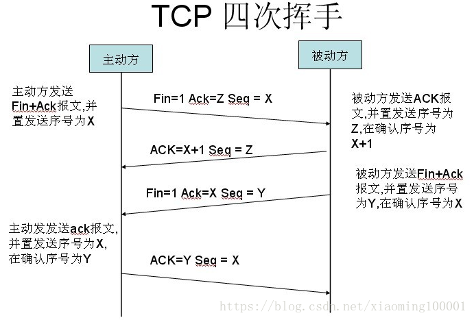
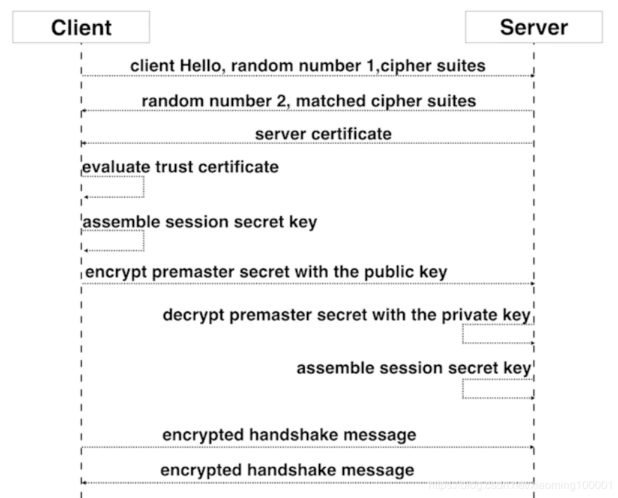
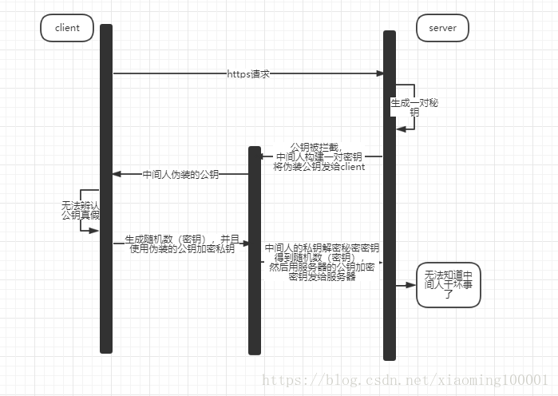
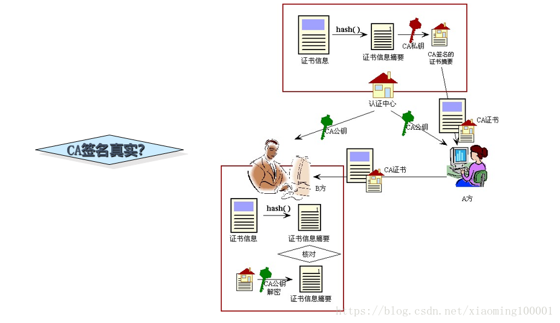

# Http与Https

##### HTTP报文格式

##### HTTP特点：

1. 无状态：协议对客户端没有状态存储，对事物处理没有“记忆”能力，比如访问一个网站需要反复进行登录操作
2. 无连接：HTTP/1.1之前，由于无状态特点，每次请求需要通过TCP三次握手四次挥手，和服务器重新建立连接。比如某个客户机在短时间多次请求同一个资源，服务器并不能区别是否已经响应过用户的请求，所以每次需要重新响应请求，需要耗费不必要的时间和流量。
3. 基于请求和响应：基本的特性，由客户端发起请求，服务端响应
4. 简单快速、灵活
5. 通信使用明文、请求和响应不会对通信方进行确认、无法保护数据的完整性

###### 针对无状态的一些解决策略：

###### 场景：逛电商商场用户需要使用的时间比较长，需要对用户一段时间的HTTP通信状态进行保存，比如执行一次登陆操作，在30分钟内所有的请求都不需要再次登陆。

1. 通过Cookie/Session技术
2. HTTP/1.1持久连接（HTTP keep-alive）方法，只要任意一端没有明确提出断开连接，则保持TCP连接状态，在请求首部字段中的Connection: keep-alive即为表明使用了持久连接

#### HTTPS特点：

基于HTTP协议，通过SSL或TLS提供加密处理数据、验证对方身份以及数据完整性保护

1. 内容加密：采用混合加密技术，中间者无法直接查看明文内容
2. 验证身份：通过证书认证客户端访问的是自己的服务器
3. 保护数据完整性：防止传输的内容被中间人冒充或者篡改

> **混合加密：**结合非对称加密和对称加密技术。客户端使用对称加密生成密钥对传输数据进行加密，然后使用非对称加密的公钥再对秘钥进行加密，所以网络上传输的数据是被秘钥加密的密文和用公钥加密后的秘密秘钥，因此即使被黑客截取，由于没有私钥，无法获取到加密明文的秘钥，便无法获取到明文数据。
>
> 
> **数字摘要：**通过单向hash函数对原文进行哈希，将需加密的明文“摘要”成一串固定长度(如128bit)的密文，不同的明文摘要成的密文其结果总是不相同，同样的明文其摘要必定一致，并且即使知道了摘要也不能反推出明文。
>
> **数字签名技术：**数字签名建立在公钥加密体制基础上，是公钥加密技术的另一类应用。它把公钥加密技术和数字摘要结合起来，形成了实用的数字签名技术。

- 收方能够证实发送方的真实身份；
- 发送方事后不能否认所发送过的报文；
- 收方或非法者不能伪造、篡改报文。

非对称加密过程需要用到公钥进行加密，那么公钥从何而来？其实公钥就被包含在数字证书中，数字证书通常来说是由受信任的数字证书颁发机构CA，在验证服务器身份后颁发，证书中包含了一个密钥对（公钥和私钥）和所有者识别信息。数字证书被放到服务端，具有服务器身份验证和数据传输加密功能。

### HTTP通信传输

客户端输入URL回车，DNS解析域名得到服务器的IP地址，服务器在80端口监听客户端请求，端口通过TCP/IP协议（可以通过Socket实现）建立连接。HTTP属于TCP/IP模型中的运用层协议，所以通信的过程其实是对应数据的入栈和出栈。

报文从运用层传送到运输层，运输层通过TCP三次握手和服务器建立连接，四次挥手释放连接。

为什么需要三次握手呢？为了防止已失效的连接请求报文段突然又传送到了服务端，因而产生错误。

比如：client发出的第一个连接请求报文段并没有丢失，而是在某个网络结点长时间的滞留了，以致延误到连接释放以后的某个时间才到达server。本来这是一个早已失效的报文段，但是server收到此失效的连接请求报文段后，就误认为是client再次发出的一个新的连接请求，于是就向client发出确认报文段，同意建立连接。假设不采用“三次握手”，那么只要server发出确认，新的连接就建立了，由于client并没有发出建立连接的请求，因此不会理睬server的确认，也不会向server发送数据，但server却以为新的运输连接已经建立，并一直等待client发来数据。所以没有采用“三次握手”，这种情况下server的很多资源就白白浪费掉了。

为什么需要四次挥手呢？TCP是全双工模式，当client发出FIN报文段时，只是表示client已经没有数据要发送了，client告诉server，它的数据已经全部发送完毕了；但是，这个时候client还是可以接受来server的数据；当server返回ACK报文段时，表示它已经知道client没有数据发送了，但是server还是可以发送数据到client的；当server也发送了FIN报文段时，这个时候就表示server也没有数据要发送了，就会告诉client，我也没有数据要发送了，如果收到client确认报文段，之后彼此就会愉快的中断这次TCP连接。

### HTTPS实现原理

**SSL建立连接过程**

1. client向server发送请求https://baidu.com，然后连接到server的443端口，发送的信息主要是随机值1和客户端支持的加密算法。
2. server接收到信息之后给予client响应握手信息，包括随机值2和匹配好的协商加密算法，这个加密算法一定是client发送给server加密算法的子集。
3. 随即server给client发送第二个响应报文是数字证书。服务端必须要有一套数字证书，可以自己制作，也可以向组织申请。区别就是自己颁发的证书需要客户端验证通过，才可以继续访问，而使用受信任的公司申请的证书则不会弹出提示页面，这套证书其实就是一对公钥和私钥。传送证书，这个证书其实就是公钥，只是包含了很多信息，如证书的颁发机构，过期时间、服务端的公钥，第三方证书认证机构(CA)的签名，服务端的域名信息等内容。
4. 客户端解析证书，这部分工作是由客户端的TLS来完成的，首先会验证公钥是否有效，比如颁发机构，过期时间等等，如果发现异常，则会弹出一个警告框，提示证书存在问题。如果证书没有问题，那么就生成一个随即值（预主秘钥）。
5. 客户端认证证书通过之后，接下来是通过随机值1、随机值2和预主秘钥组装会话秘钥。然后通过证书的公钥加密会话秘钥。
6. 传送加密信息，这部分传送的是用证书加密后的会话秘钥，目的就是让服务端使用秘钥解密得到随机值1、随机值2和预主秘钥。
7. 服务端解密得到随机值1、随机值2和预主秘钥，然后组装会话秘钥，跟客户端会话秘钥相同。
8. 客户端通过会话秘钥加密一条消息发送给服务端，主要验证服务端是否正常接受客户端加密的消息。
9. 同样服务端也会通过会话秘钥加密一条消息回传给客户端，如果客户端能够正常接受的话表明SSL层连接建立完成了。

问题：
**1.怎么保证保证服务器给客户端下发的公钥是真正的公钥，而不是中间人伪造的公钥呢？**

**2.证书如何安全传输，被掉包了怎么办？**

**数字证书内容**
包括了加密后服务器的公钥、权威机构的信息、服务器域名，还有经过CA私钥签名之后的证书内容（经过先通过Hash函数计算得到证书数字摘要，然后用权威机构私钥加密数字摘要得到数字签名)，签名计算方法以及证书对应的域名。

**验证证书安全性过程**

1. 当客户端收到这个证书之后，使用本地配置的权威机构的公钥对证书进行解密得到服务端的公钥和证书的数字签名，数字签名经过CA公钥解密得到证书信息摘要。
2. 然后证书签名的方法计算一下当前证书的信息摘要，与收到的信息摘要作对比，如果一样，表示证书一定是服务器下发的，没有被中间人篡改过。因为中间人虽然有权威机构的公钥，能够解析证书内容并篡改，但是篡改完成之后中间人需要将证书重新加密，但是中间人没有权威机构的私钥，无法加密，强行加密只会导致客户端无法解密，如果中间人强行乱修改证书，就会导致证书内容和证书签名不匹配。

**那第三方攻击者能否让自己的证书显示出来的信息也是服务端呢？**（伪装服务端一样的配置）显然这个是不行的，因为当第三方攻击者去CA那边寻求认证的时候CA会要求其提供例如域名的whois信息、域名管理邮箱等证明你是服务端域名的拥有者，而第三方攻击者是无法提供这些信息所以他就是无法骗CA他拥有属于服务端的域名。

### 运用与总结

##### 安全性考虑：

1. HTTPS协议的加密范围也比较有限，在黑客攻击、拒绝服务攻击、服务器劫持等方面几乎起不到什么作用
2. SSL证书的信用链体系并不安全，特别是在某些国家可以控制CA根证书的情况下，中间人攻击一样可行

> 中间人攻击（MITM攻击）是指，黑客拦截并篡改网络中的通信数据。又分为被动MITM和主动MITM，被动MITM只窃取通信数据而不修改，而主动MITM不但能窃取数据，还会篡改通信数据。最常见的中间人攻击常常发生在公共wifi或者公共路由上。

##### 成本考虑：

1. SSL证书需要购买申请，功能越强大的证书费用越高
2. SSL证书通常需要绑定IP，不能在同一IP上绑定多个域名，IPv4资源不可能支撑这个消耗（SSL有扩展可以部分解决这个问题，但是比较麻烦，而且要求浏览器、操作系统支持，Windows XP就不支持这个扩展，考虑到XP的装机量，这个特性几乎没用）。
3. 根据ACM CoNEXT数据显示，使用HTTPS协议会使页面的加载时间延长近50%，增加10%到20%的耗电。
4. HTTPS连接缓存不如HTTP高效，流量成本高。
5. HTTPS连接服务器端资源占用高很多，支持访客多的网站需要投入更大的成本。
6. HTTPS协议握手阶段比较费时，对网站的响应速度有影响，影响用户体验。比较好的方式是采用分而治之，类似12306网站的主页使用HTTP协议，有关于用户信息等方面使用HTTPS。