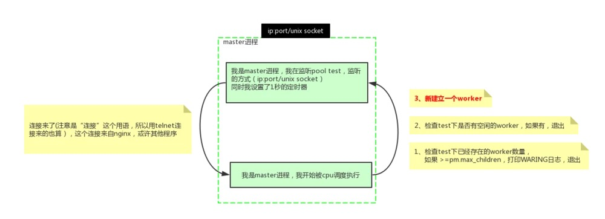
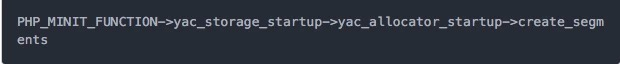
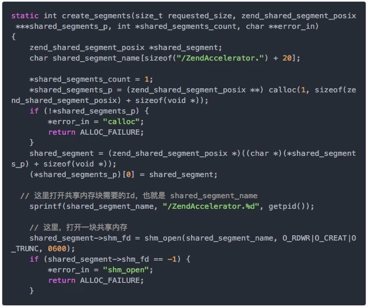

## FPM

> fpm进程设置cpu亲和性，前提是php-fpm配置成static模式  （static静态 dynamic动态  ondemand按需）
> 后续需要测试下是否会发生1核有难9核围观的场景??

	#!/bin/bash
	cat /usr/local/php7/var/run/php-fpm.pid | xargs kill -USR2
	sleep 3
	CPUs=$(grep -c processor /proc/cpuinfo)
	PIDs=$(ps -ef | grep "php-fpm" | awk '{print $2}')
	
	let i=0
	for PID in $PIDs; do
	   CPU=$(echo "$i % $CPUs" | bc)
	   let i++
	
	   taskset -pc $CPU $PID
	done

PHP-FPM 提供了更好的 PHP 进程管理方式，可以有效控制内存和进程、可以平滑重载PHP配置。那么当我们谈论 PHP-FPM 多进程模型的时候，作为 PHPer 的你了解多少呢？

首先，让我们一起看几个问题：
①：PHP-FPM 启动进程的方式主要有哪几种，区别是什么？
②：PHP-FPM，是主进程接收请求转给子进程，还是子进程单独接收请求并处理，如何验证？
③：为何在 PHP-FPM 模式下，PHP 代码很少有人去做连接池？
④：PHP-FPM 模式性能差的体现有哪些，如何优化？
⑤：PHP-FPM 模式下的 YAC 为何无法和 CLI 模式无法共享内存？

# 1. 如何启动进程

PHP-FPM 是多进程模式，由 Master 进程管理 Worker 进程。进程的数量，都可以通过 php-fpm.conf 做具体配置。 PHP-FPM 的进程可以分为动态模式及静态模式：

## ①：静态（Static）

直接开启指定数量的 PHP-FPM 进程，不再增加或者减少；启动固定数量的进程，占用内存高。但在用户请求波动大的时候，对 Linux 操作系统进程的处理上耗费的系统资源低。

## ②：动态（Dynamic）

开始时开启一定数量的 PHP-FPM 进程，当请求量变大的时候，动态增加 PHP-FPM 进程数到上限，当空闲的时候自动释放空闲进程数到一个下限。

动态模式会根据 max、min、idle children 配置，动态的调整进程数量。在用户请求较为波动，或者瞬间请求增高的时候，动态模式下会进行大量进程的创建、销毁等操作，而造成 Linux 负载波动升高。简单来说，请求量少，PHP-FPM 进程数少，请求量大，进程数多。优势就是，当请求量小的时候，进程数少，内存占用也小。

## ③：按需 （Ondemand）

这种模式下，PHP-FPM 的 Master 不会 Fork 任何子进程，纯粹就是按需启动。

这种模式通常很少使用，因为它基本无法适应有一定量级的线上业务。由于 php-fpm 是短连接的，所以每次请求都会先建立连接，建立连接的过程必然会触发上图的执行步骤。所以，在大流量的系统上 Master 进程会变得繁忙，占用系统 CPU 资源，不适合大流量环境的部署。

借用一张网络图片来说明：

需要注意 2 个点，「连接」和「数据」到来。有连接进来再 Fork 进程，同样可以达到子进程继承父进程上下文，然后子进程处理用户请求这个目的。

（关于动态、静态进程模式的相关参数，可参考 PHP 官方文档。）

我们需要关注的是对于我们自身的业务，应该选择的 PHP-FPM 模式为动态还是静态。

通常来说，对于比较大内存的服务器，设置为静态的话会提高效率。因为频繁开关 php-fpm 进程也会有时滞，所以内存够大的情况下开静态效果会更好。数量也可以根据 内存/30M 得到。比如说 2GB 内存的服务器，可以设置为 50；4GB 内存可以设置为 100 等。高配机器选静态，低配机器（省内存）选动态，高配机器用动态不能充分利用内存资源和 CPU 资源，也无法及时应对瞬时高并发。

# 2. 如何进行请求处理和验证

PHP-FPM 的进程管理方式和 Nginx 的进程管理方式有些类似。在处理请求时，并非由主进程接受请求后转给子进程，而是子进程「抢占式」地接受用户请求。本质上 PHP-FPM 多进程以及 Nginx 多进程，都是在主进程监听同一个端口后，Fork 子进程达到多个进程监听同一端口的目的。

Linux 系统所有的进程 IO 操作，都需要和操作系统打交道。也就是说，系统知道所有 IO 操作。这个过程就是我们常说的「系统调用」。我们可以从系统调用入手解决这个问题。系统调用的查看，可以使用 Strace。

如何验证相对简单，我们可以采取 2 种方式：

- 看 PHP-FPM 进程的日志。这需要配置好合适的 PHP-FPM 日志格式；
- 既然 IO 数据会通过内核态过度到用户态进程，我们可以通过 strace -p 命令去跟踪系统调用。分别跟踪 PHP-FPM 的主进程 ID 以及子进程 ID，然后访问 Nginx，由 Nginx 通过 fast-cgi 协议转到 PHP-FPM 进程上，看在哪个进程上发送了系统调用。

# 3. 为何不在 PHP-FPM 下做代码连接池 ？

首先，在 PHP-FPM 模式下，一个请求的生命周期注定只有 1 次。也就是说，从 FPM 请求到请求、解析 PHP 脚本，到 FPM 的 Zend 虚拟机分配资源执行，再到最后的处理结束，PHP-FPM 会回收这次请求的所有资源。

这种方式一是为了让开发不需要关心资源的回收处理，所以你可能没怎么关心过网络的关闭、文件描述符的关闭等等。二是为了减少内存溢出的情况。

如果在这种模式下，你实现了连接池，也意味着请求结束，连接池消失，做了一次无用功而已。

「鸡肋的」PConnect（持久化链接）。持久化链接也就是链接不释放。但问题在于，PHP-FPM 是多进程模式，而持久化的链接存在于进程中。这就意味着，如果一台机器有 300 个 FPM 进程，会一次性初始化 300 个持久化链接。如果因为面临业务活动需求冒然对机器扩容，很可能造成业务的数据库连接数直接打满。

# 4. 如何优化性能

首先，我们应该思考导致性能差可能的原因是什么。如果一个应用的性能差，我们往往会从 2 个方面来分析，一个是 IO 性能，一个是计算性能。

IO 方面，因为 PHP-FPM 模式下难以做连接池，所以高并发业务下的网络处理会有劣势。注意我这里一直说的都是 PHP-FPM 模式下，在 CLI 模式下还是可以自己做连接池的。只不过这个连接池仅限于 CLI 模式的单进程内，而且这个模式不能用于处理网络请求（比如 HTTP 请求）。因为 PHP 默认单进程模式，FPM、CLI 都是默认单进程，即便 CLI 可以做连接池 ，也不方便做链接保活（不能同时做心跳检测）。

计算性能上来说，虽然 PHP 是用 C 写的，如果单纯论计算性能是不错的。但问题在于 PHP 处理请求时，每次都要解析 PHP 脚本、翻译 PHP 代码为 Opcode、用 Zend 虚拟机执行 Opcode，处理结束，释放资源。经历这样的过程 是导致 PHP 计算性能慢的最大原因之一。

如何优化：

- 对于计算性能来说，使用 Zend OPcache 扩展，缓存字节码。
- 对于** IO 性能**来说，使用文件 cache 或者 memcached 减轻对网络 Cache 的压力；使用 Yac 减轻对 Cache 层的压力；在同一次请求中；复用链接不要每次都用新的；合理设计日志组件类库，优化 Logger 减少对文件操作的次数来减少 IO 的压力。

关于设计一个合格的 Logger 组件，我们需要注意几个点：
① 每次请求，只做一次日志写操作，不要每次别人调用你的函数，你都去执行一次类似 file_put_contents 的操作。
② 兼容各种类似错误。换句话说，即使 PHP fatal error 了，你也得能把知名错误之前的日志记录下来。这个实现可以借助 PHP 类的析构方法来做。也可以使用更好的 register_shutdown_function 来注册一个钩子，在 PHP 请求结束的时候，回调此钩子，完成做最后的日志操作。

# 5. YAC 为何无法和 CLI 模式共享内存

我们知道，PHP 扩展开发中首要执行的一个宏是 PHP_MINIT_FUNCTION。YAC 扩展需要在 PHP-FPM 进程启动时起就初始化一块共享内存，供各个进程来共享使用。因此，实现共享的关键在于需要一个让各个进程都知道的相同标识。

YAC 扩展的初始化流程为：

我们查看 create_segments 的具体实现：

上面做了一些注释，最关键的是要开启共享内存需要的系统 ID，shared_segment_name，此值包含了进程 ID。也就是 PHP-FPM 的主进程 ID。有相同的共享内存标识 ID，就是 PHP-FPM 模式所有进程间能够通信的奥秘所在。而如果我们是想要通过 PHP 脚本使用 yac 扩展读取这个共享内存，会这样做：

在 CLI 模式下，这样是不可能拿到 PHP-FPM 模式下设置的共享内存数据的。因为 CLI 模式下执行 PHP 脚本、进程 ID，和 PHP-FPM 模式下的进程 ID 完全不相同。

后面的文章中，我们会找机会讲一讲进程间通讯，以及基于共享内存的通讯。总结来说，多进程要共享内存通信，必须要一开始就协调好一个唯一 ID。这个 ID 多个进程间都要知道。PHP-FPM 是多进程，主进程 fork 子进程出来，子进程自然知道这个唯一 ID 是什么（因为 Linux 进程 fork 会把整个进程的堆栈内存都 fork 一遍）。但是，php a.php 这样执行，其实是一个完全独立的进程，和 PHP-FPM 没任何关系，这样的进程，也就不能知道 PHP-FPM 进程里的那个唯一 ID 是什么。