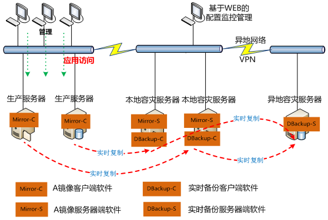

## 高可用

### 灾备

 是指容灾和备份。容灾是为了在遭遇灾害时能保证信息系统能正常运行，帮助企业实现业务7*24小时连续性的目标，备份是为了应对灾难来临时造成的数据丢失问题。容灾备份产品的最终目标是帮助企业应对人为误操作、软件错误、病毒入侵等“软”性灾害以及硬件故障、自然灾害等“硬”性灾害。

两地三中心：

- 两地是指**同城、异地**
- 三中心是指**生产中心、同城容灾中心、异地容灾中心**。

### 多区域部署

### LVS集群

### 应用集群

### 本地缓存

### 缓存集群

### CDN

### 浏览器缓存

### web服务器缓存

### 数据读写分离

### 分库分表